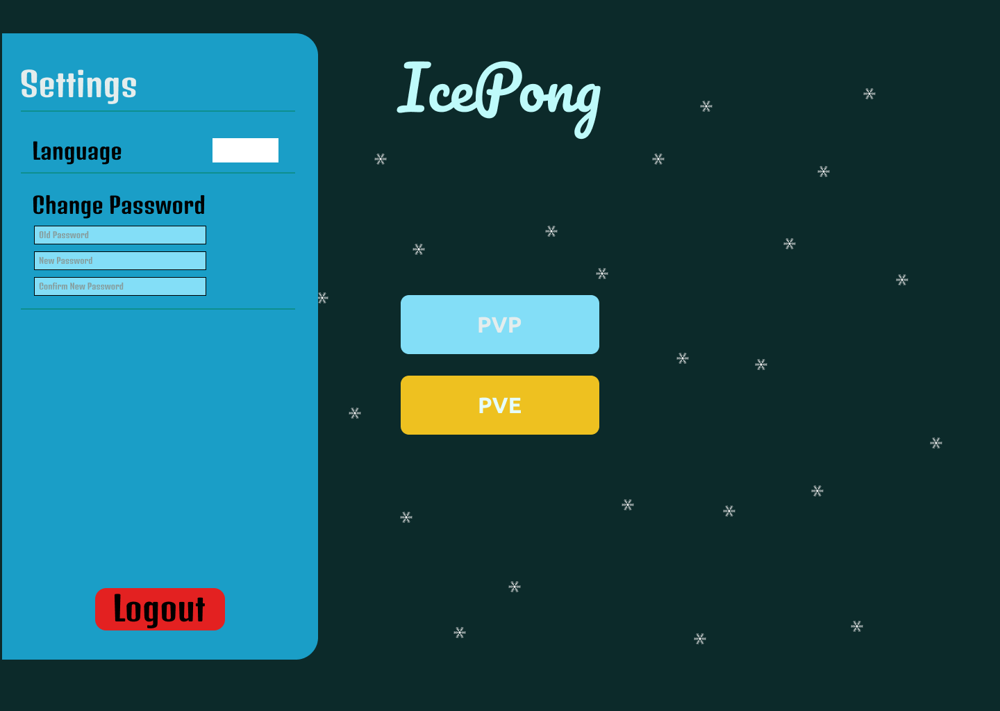
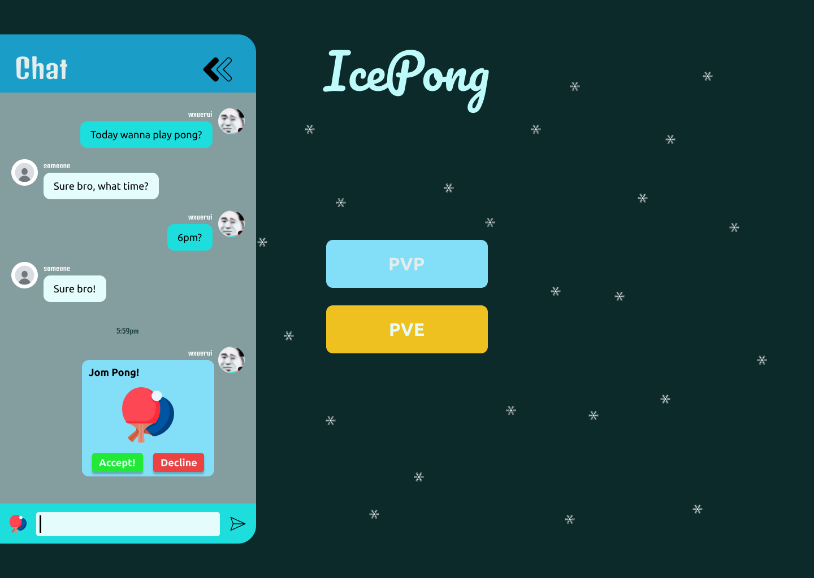

# Ft_transcendence

- Python Version: 3.12.0
- Created by: <b>Brook, Qixeo, Joseph, Xuerui, Mark </b>


## Dev Setup

```bash
# Setup and activate python virtual environment for dev
$ python3 -m venv .venv
$ source .venv/bin/activate # use the deactivate command to deactivate the venv
$ pip install -r requirements.txt

# create the .env file
$ cp .env.example .env

# generate the secret key for django and copy it, paste to .env DJANGO_SECRET_KEY
$ python manage.py shell -c 'from django.core.management import utils; print(utils.get_random_secret_key())'

# spawn all docker containers, networks and volumes
$ make build-up

# When you change any of the django files, the django dev server will reload thanks to docker volume and watchdog

# stop all containers
$ make down
```


## Modules

### Web
- [x] Major module: Use a Framework as backend.
- [x] Minor module: Use a front-end framework or toolkit.
- [x] Minor module: Use a database for the backend.
- [x] Major module: Store the score of a tournament in the Blockchain.

### User Management
- [x] Major module: Standard user management, authentication, users across
tournaments. - -**By Brook (WIP)**
- [x] Major module: Implementing a remote authentication. -**By Brook**

### Gameplay and user experience
- [x] Major module: Remote players
- [ ] Major module: Multiplayers (more than 2 in the same game).
- [x] Major module: Add Another Game with User History and Matchmaking.
- [ ] Minor module: Game Customization Options.
- [x] Major module: Live chat.

### AI-Algo
- [x] Major module: Introduce an AI Opponent.
- [ ] Minor module: User and Game Stats Dashboards

### Cybersecurity
- [ ] Major module: ImplementWAF/ModSecurity with Hardened Configuration
and HashiCorp Vault for Secrets Management.
- [ ] Minor module: GDPR Compliance Options with User Anonymization, Local
Data Management, and Account Deletion.
- [x] Major module: Implement Two-Factor Authentication (2FA) and JWT.

### Devops
- [ ] Major module: Infrastructure Setup for Log Management.
- [ ] Minor module: Monitoring system.
- [ ] Major module: Designing the Backend as Microservices.

### Graphics
- [ ] Major module: Use of advanced 3D techniques.

### Accessibility
- [ ] Minor module: Support on all devices.
- [x] Minor module: Expanding Browser Compatibility.
- [ ] Minor module: Multiple language supports.
- [ ] Minor module: Add accessibility for Visually Impaired Users.
- [ ] Minor module: Server-Side Rendering (SSR) Integration.

### Server-Side Pong
- [ ] Major module: Replacing Basic Pong with Server-Side Pong and Implementing
an API.
- [ ] Major module: Enabling Pong Gameplay via CLI against Web Users with
API Integration.

## Reference

AllAuth Provider - 
https://www.chenshiyang.com/archives/696

# 42-KL Project Ft_transcendence: AIS PONG

<p align="center">
  <image alt="aispongpng" src="files/aispong.png">
</p>

## Overview

Ft_transcendence is the last project in 42KL Core Program. AIS PONG is a multiplayer pong game with a onepage fullstack website.
It has implemented the following technologies:
- Frontend: HTML, CSS, JavaScript, React, Redux, Webpack, Babel, ESLint, Prettier, Jest, React Testing Library, Docker, GitHub Pages
- Backend: Python, Django, Docker, PostgresSQL, OAuth, 2Fa & JWT, Log Management, Microservices, Server-Side Rendering (SSR)

Game Features:
- lobby chat
- private messages
- friends list
- profiles
- match-making
- gamemodes: pvp, pve, tournament

## Usage
>  You need to have docker installed on your machine to run the project <br>

```bash
docker compose -f ./docker-compose.yml up -d
```
>  You can also use the makefile command to run the docker env <br>
    
```bash
make build-up
```

```bash
make build-up
```

you should be able to access the website at `http://localhost:8000`.

### **Test server**: You could also test the AIS PONG on https://42pong.brookchin.tech/

# Screenshots







## Team Members:
<table>
  <tr>
    <td align="center"><a href="https://github.com/brook5407/"><br /><sub><b>brook5407 (chchin)</b></sub></a><br /><a href="https://profile.intra.42.fr/users/chchin" title="Intra 42"></a></td>
    <td align="center"><a href="https://github.com/wangxuerui2003/"><br /><sub><b>Assxios (droge)</b></sub></a><br /><a href="https://profile.intra.42.fr/users/wxuerui" title="Intra 42"></a></td>
    <td align="center"><a href="https://github.com/kiottoy/"><br /><sub><b>Nimon77 (nsimon)</b></sub></a><br /><a href="https://profile.intra.42.fr/users/yichan" title="Intra 42"></a></td>
    <td align="center"><a href="https://github.com/Cloonie/"><br /><sub><b>ademjemaa (adjemaa)</b></sub></a><br /><a href="https://profile.intra.42.fr/users/mliew" title="Intra 42"></a></td>
  </tr>
</table>

- - -
