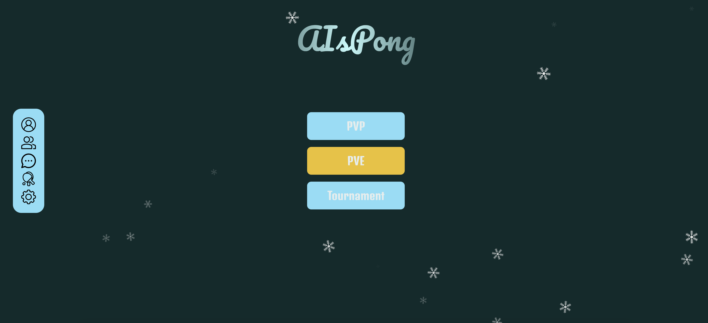
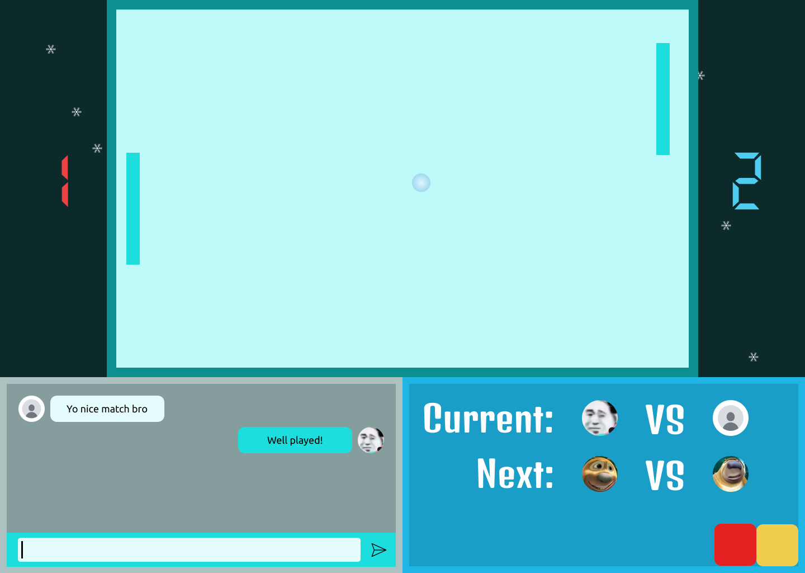

<h1 align="center">
    🎮ft_transcendence
</h1>

<p align="center">
	<b><i>This project is about doing something you’ve never done before.
 Remind yourself the beginning of your journey in computer science.
 Look at you now. Time to shine!</i></b><br>
</p>

<p align="center">
  <image alt="aispong" src="files/aispong.gif"></image>
</p>

<p align="center">
	
	
	
	
	
</p>

<h3 align="center">
	<a href="#-about">About</a>
	<span> · </span>
    <a href="#-modules">Modules</a>
    <span> · </span>
  	<a href="#-content">Content</a>
	<span> · </span>
	<a href="#-usage">Usage</a>
	<span> · </span>
	<a href="#-screenshots">Screenshots</a>

</h3>

## 💡 About

 > This project is about creating a website for the mighty Pong contest!

## 📚 Modules

### 🌐 Web
- [x] Major module: Use a Framework as backend.
- [x] Minor module: Use a front-end framework or toolkit.
- [x] Minor module: Use a database for the backend.
- [ ] Major module: Store the score of a tournament in the Blockchain.

### 👤 User Management
- [x] Major module: Standard user management, authentication, users across
tournaments.
- [x] Major module: Implementing a remote authentication.

### 🕹️ Gameplay and user experience
- [x] Major module: Remote players
- [ ] Major module: Multiplayers (more than 2 in the same game).
- [ ] Major module: Add Another Game with User History and Matchmaking.
- [ ] Minor module: Game Customization Options.
- [x] Major module: Live chat.

### 👾 AI-Algo
- [x] Major module: Introduce an AI Opponent.
- [x] Minor module: User and Game Stats Dashboards

### 🛡️ Cybersecurity
- [ ] Major module: ImplementWAF/ModSecurity with Hardened Configuration
and HashiCorp Vault for Secrets Management.
- [ ] Minor module: GDPR Compliance Options with User Anonymization, Local
Data Management, and Account Deletion.
- [x] Major module: Implement Two-Factor Authentication (2FA) and JWT.

### 🏗️ Devops
- [x] Major module: Infrastructure Setup for Log Management.
- [ ] Minor module: Monitoring system.
- [ ] Major module: Designing the Backend as Microservices.

### 🖥️ Graphics
- [ ] Major module: Use of advanced 3D techniques.

### 📲 Accessibility
- [ ] Minor module: Support on all devices.
- [x] Minor module: Expanding Browser Compatibility.
- [x] Minor module: Multiple language supports.
- [ ] Minor module: Add accessibility for Visually Impaired Users.
- [x] Minor module: Server-Side Rendering (SSR) Integration.

### 🗄️ Server-Side Pong
- [ ] Major module: Replacing Basic Pong with Server-Side Pong and Implementing
an API.
- [ ] Major module: Enabling Pong Gameplay via CLI against Web Users with
API Integration.

## 🚀 Content

### 🛠️ Tech Stack

- **Frontend**: Vanilla JS
- **Backend**: Django
- **Database**: PostgreSQL
- **DevOps**: Docker
- **Cloud**: DigitalOcean Droplet

### ⚡ Game Features:
- Lobby chat
- Private messages
- Friends list
- User Profiles
- Match-making
- Game Modes: PVP, PVE, Tournament

## ▶️ Usage
>  You need to have docker installed on your machine to run the project <br>

```bash
docker compose -f ./docker-compose.yml up -d
```
>  You can also use the makefile command to run the docker env <br>
    
```bash
make up
```

> You could also test the AIS PONG on https://42pong.brookchin.tech/

## 📸 Screenshots







## Team Members:
<table>
  <tr>
    <td align="center"><a href="https://github.com/brook5407/"><br /><sub><b>brook5407 (chchin)</b></sub></a><br /><a href="https://profile.intra.42.fr/users/chchin" title="Intra 42"></a></td>
    <td align="center"><a href="https://github.com/wangxuerui2003/"><br /><sub><b>Assxios (droge)</b></sub></a><br /><a href="https://profile.intra.42.fr/users/wxuerui" title="Intra 42"></a></td>
    <td align="center"><a href="https://github.com/kiottoy/"><br /><sub><b>Nimon77 (nsimon)</b></sub></a><br /><a href="https://profile.intra.42.fr/users/yichan" title="Intra 42"></a></td>
    <td align="center"><a href="https://github.com/Cloonie/"><br /><sub><b>ademjemaa (adjemaa)</b></sub></a><br /><a href="https://profile.intra.42.fr/users/mliew" title="Intra 42"></a></td>
  </tr>
</table>

- - -
